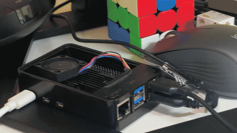
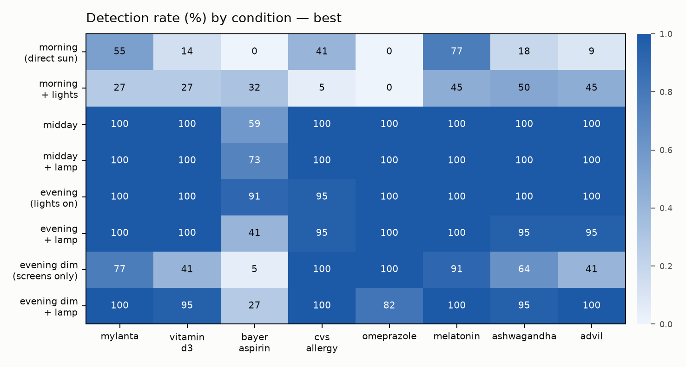

# MeSA 2.0 — Medication & Safety Assistant Robot

A tabletop assistive robot (Raspberry Pi 5, one webcam, ~$150) that helps an at-risk
person stay safe and on schedule with medication: it recognizes medication containers,
logs doses, watches for falls, answers voice questions, and escalates to a caregiver
when something's wrong. Built solo in a 10-week summer sprint — and then turned into a
research instrument that measured the limits of its own vision.

> ⚠️ **Assistive aid, not a medical device.** Fall detection is tested only with staged
> poses on cushions and must not be relied on for real emergencies.

## Status (Aug 2026)

| Demo | Status |
|------|--------|
| **MED** — recognize 8 medications, flag unknowns as "wrong medication" | ✅ live-verified (test mAP@50 **0.953**) |
| **LOG** — bottle absent ≥10 s then returned → timestamped `taken` event → dashboard | ✅ live-verified on the Pi |
| **FALL** — standing/sitting/lying; sustained lying → spoken check-in | ✅ live-verified (incl. lying-detection fallback chain) |
| **VOICE** — offline: next med, did-I-take, call-for-help, date/time, "I'm okay" | ✅ live-verified |
| **ESCALATE** — L1 spoken check-in → L2 push (ntfy) → L3 caregiver alert | 🟡 logic + plumbing done; live run scheduled |
| *(Stretch)* pan-tilt head tracking, OLED emotions | coded + unit-tested; on-Pi verification pending |

## Hardware tour



*Full 90-second silent walkthrough of the rig (Pi 5, camera mount, marked medication
station, LED lamp, speakerphone): [setup tour video](https://github.com/VrishaankMishra/mesa-ai-robot/releases/tag/setup-tour-v1).*

## The research: MeSA measures her own blind spots

The detector scored 0.953 mAP@50 — then failed at 8 PM in its own room. Instead of
patching around that, the robot became the instrument: a **voice-guided evaluation
protocol where scripted placement makes ground truth free** — 1,728 labeled field
evaluations across an 8-condition lighting grid × 3 model arms, zero manual annotation,
~90 minutes of operator time.

**Findings** (paper preprint forthcoming on arXiv ·
data: [docs/eval/domain_shift_results.csv](docs/eval/domain_shift_results.csv) ·
figures: [docs/eval/figures/](docs/eval/figures)):

- Detection collapses at **both** lighting extremes — direct morning sun is *worse than
  near-darkness* — and which containers fail is set by their reflectance (the victims
  **invert** between extremes).
- A **$10 LED lamp** restores near-dark detection from 38–71% → 92–100%.
- The wrong-medication safeguard **degrades as lighting improves** (confident vision =
  confident misidentification of look-alikes) — a safety asymmetry.
- Naive synthetic lighting augmentation **failed off-domain** while remaining
  indistinguishable on validation mAP — the three arms span 44 deployed points inside a
  0.95–0.98 validation band.



## Architecture

One process, one event queue. Vision and audio workers publish events; the decision
engine consumes them and drives compliance, fall, and escalation logic.

```
USB cam ─▶ Vision (YOLOv8n detect + MediaPipe pose w/ lying fallback) ─┐
USB mic ─▶ Audio  (Vosk STT + intents + pyttsx3 TTS)                   ├─▶ EventBus ─▶ Decision engine ─┬─▶ SQLite (events.db)
                                                                       │                               ├─▶ Streamlit dashboard (LAN)
                                                                       │                               ├─▶ ntfy.sh push alerts
                                                                       └───────────────────────────────┴─▶ Hardware: PCA9685 servos, SSD1306 OLED
```

## Quick start (laptop, no hardware)

Works on Intel macOS, Apple Silicon, and Linux. Requires **Python 3.11 or 3.12** —
*not 3.13* (the pinned mediapipe has no 3.13 wheel); the setup script enforces this:

```bash
bash scripts/setup_env.sh           # creates .venv, installs the stack, verifies imports
.venv/bin/python -m pytest          # all tests green (200+)
.venv/bin/python main.py --demo     # synthetic event sequence end-to-end
```

## Running for real

| What | Command | Needs |
|------|---------|-------|
| **Everything live** | `python main.py --live` | camera (+ mic, + `models/best.pt`) |
| Live detection only | `python scripts/detect_live.py` | camera + `models/best.pt` |
| Live posture/fall | `python scripts/pose_live.py --headless` | camera |
| Voice loop | `python scripts/voice_loop.py` | mic/speaker + Vosk model |
| Dashboard | `bash scripts/run_dashboard.sh` | — (LAN at `:8501`) |
| Dataset capture (Pi, voice-guided) | `python scripts/capture_guided.py --bottles … --lighting …` | camera + speaker |
| **Domain-shift eval session** | `python scripts/eval_capture.py --condition …` | camera + speaker |
| Score eval sessions | `python scripts/eval_analyze.py --models …` | eval_data + weights |
| Regenerate paper figures | `python scripts/eval_figures.py` | results CSV |

Config (thresholds, model paths, ntfy topic) lives in [`config.yaml`](config.yaml).
Weights and images are gitignored — see [`models/README.md`](models/README.md) and
[`datasets/README.md`](datasets/README.md) for the real inventory.

## Layout

```
mesa/
├── vision/      detector.py (YOLO + unknown-med logic), pose_estimator.py (MediaPipe
│                + lying fallback chain), posture.py, worker.py (live camera thread)
├── audio/       intents.py, assistant.py, stt.py (swappable), tts.py, worker.py
├── engine/      presence.py, compliance.py, escalation.py, inactivity.py,
│                events.py (EventBus), decision.py, schedule_gen.py
├── data/        database.py (SQLite)
├── hardware/    tracking.py, servos.py, oled.py, emotions.py (Pi-only plug modules)
├── research/    buffer.py, features.py, clip_io.py (pre-event capture layer)
└── dashboard/   app.py (Streamlit)
scripts/   setup_env, capture, capture_guided, detect_live, pose_live, voice_loop,
           eval_capture, eval_analyze, eval_figures, benchmark, soak_test, …
docs/      eval/ (results + figures) · demo-runbook.md · domain-shift-sessions.md
           IMPLEMENTATION.md (ticket board) · capture-protocol.md · hardware-build.md
deploy/    mesa.service, install_pi.sh
```

## Reading order for visitors

1. [The domain-shift study results](docs/eval/eval-report-v1.md) — evaluation report,
   per-condition data, and figures. Paper preprint forthcoming on arXiv.
2. [The demo runbook](docs/demo-runbook.md) — how the live show runs, every staging
   rule backed by a measurement.
3. [The ticket board](docs/IMPLEMENTATION.md) — the 10-week plan and what's done.

## Tech
Python 3.11/3.12 · OpenCV · Ultralytics YOLOv8 · MediaPipe · Vosk · pyttsx3 · SQLite ·
Streamlit · ntfy.sh · gpiozero / Adafruit CircuitPython (PCA9685, SSD1306) · pytest.
