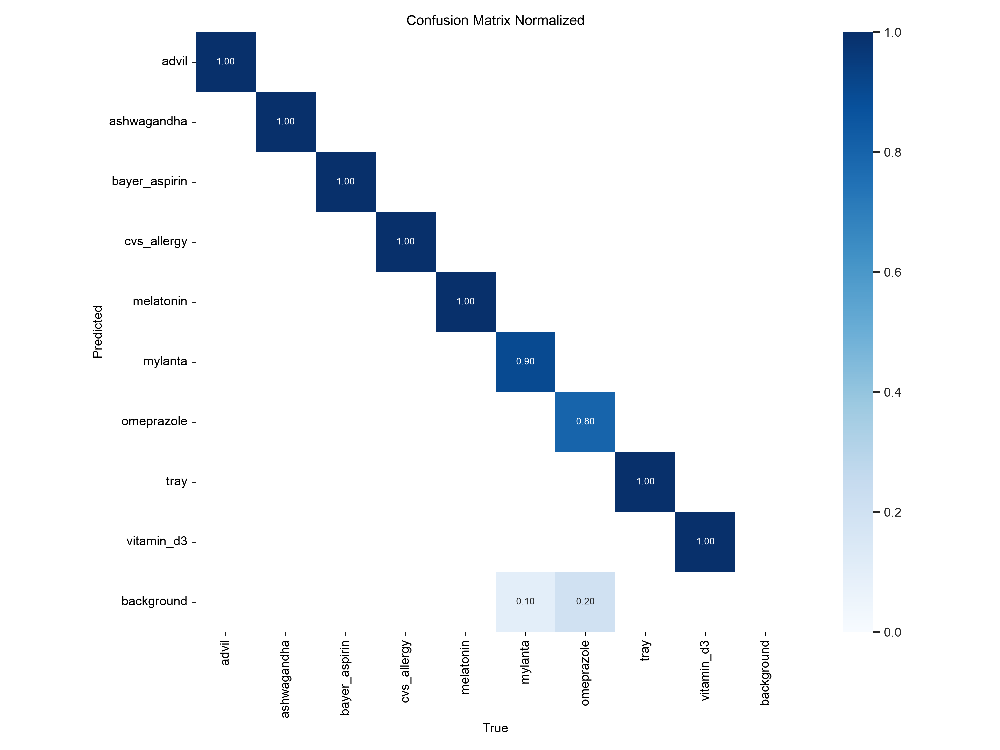

# Detector Evaluation Report — v1 (VIS-005)

**M2 GATE: PASSED.** Held-out **test mAP@50 = 0.953** (target ≥ 0.90).

## Run metadata
- Model: `models/best.pt` · base: YOLOv8n (3.0M params), fine-tuned
- Dataset version (Roboflow): `vrishaank-mishra/medication-safety-object-detecti` **v1**
- Images: 647 train (×3 aug = 1941) / 185 valid / **92 test** · 70/20/10 split
- Preprocessing: auto-orient, stretch 512×512 · aug: brightness ±15%, exposure ±10%, blur ≤1.1px, noise
- Training: Colab T4, epochs ≤100 (patience 20), imgsz 640, batch 16 (2026-08-06)
- Evaluated: 2026-08-06 on the held-out test split, locally (`ultralytics 8.2.103`)

## Headline metrics (held-out test split, never seen in training)
| Metric | Value | Target |
|--------|-------|--------|
| mAP@50 | **0.953** | ≥ 0.90 ✅ |
| mAP@50-95 | 0.581 | — |
| Precision (all) | 0.951 | |
| Recall (all) | 0.966 | |

## Per-class precision / recall (test split)
| class | precision | recall | mAP@50 |
|---|---|---|---|
| advil | 0.982 | 1.000 | 0.995 |
| ashwagandha | 0.983 | 1.000 | 0.995 |
| bayer_aspirin | 1.000 | 0.998 | 0.995 |
| cvs_allergy | 0.981 | 1.000 | 0.995 |
| melatonin | 0.989 | 1.000 | 0.995 |
| mylanta | 0.884 | 0.900 | 0.868 |
| omeprazole | 0.778 | 0.800 | 0.746 |
| tray | 0.974 | 1.000 | 0.995 |
| vitamin_d3 | 0.985 | 1.000 | 0.995 |

## Confusion matrix

Raw-count matrix: `confusion_matrix.png` · PR curve: `PR_curve.png`.

## Observations / failure cases (candidate VIS-007 items)
- **omeprazole** (small purple-cap bottle) is the weakest class (0.746) — small object,
  visually close to the other small white bottles at distance.
- **mylanta** (box, 0.868) — boxes present differently across angles than cylinders.
- Dense **tray scenes**: the tray itself is detected confidently, but bottles inside it
  often are not (grouped/occluded). Not demo-critical (demo bottles sit spread on the
  table) — revisit only if live use needs in-tray detection.
- Offline smoke test on raw captures: 63/64 top-1 correct; the four filename
  "mismatches" were all first-shot-of-cell frames still showing the *previous* bottle
  (capture-swap artifacts — the model was right; see the filename caveat in
  `docs/capture-protocol.md`).

## Decision
- [x] Test mAP@50 = 0.953 ≥ 0.90 → **M2 met. Ship v1** (`models/best.pt`).
- Levers if live testing (VIS-011) surfaces trouble: regenerate Roboflow version at
  640 letterbox (vs 512 stretch), and/or a hard-negative round (VIS-007) focused on
  omeprazole and mylanta.

## Live verification on the Pi (2026-08-07 morning)

- **Pipeline verified end-to-end:** `main.py --live` produced a real `taken` event
  (advil, absent 12 s) from a scripted bottle lift — camera → YOLO → presence
  debounce → compliance rule → SQLite. Capture-day images score 0.82–0.89 on the
  Pi itself (stack parity with the laptop confirmed).
- **Camera geometry is load-bearing:** the model needs the training view — camera
  elevated above the table looking down ~40–45°, bottles at the 0.6–0.9 m marks
  against the white tabletop. Side-on / across-the-room views drop confidence to
  0.1–0.4 or zero. This sets a mounting-height requirement for the med-station build.
- **Lighting domain gap:** all training passes were shot in evening light; in morning
  daylight, live confidences run ~0.1–0.3 below eval (best classes 0.68–0.75; the
  small omeprazole and the vitamin_d3 hover at threshold and produced 2 false
  `taken` events via sub-threshold flicker). Runtime `detection.confidence_threshold`
  lowered 0.50 → 0.45 as a stopgap.
- **Action (VIS-011, scheduled):** morning-daylight top-up round with
  `scripts/capture_guided.py` (~20 min), add to Roboflow as v2, retrain, redeploy.
- Tight clusters of bottles read as `tray` — for demos, keep bottles ≥15 cm apart.
